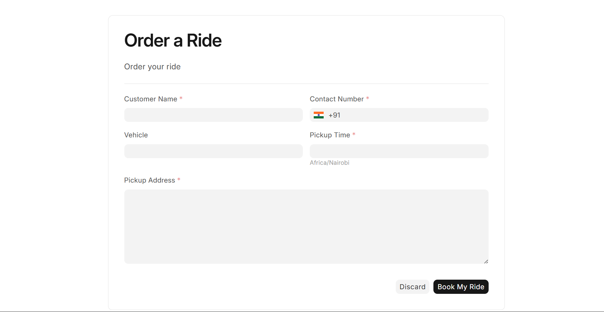
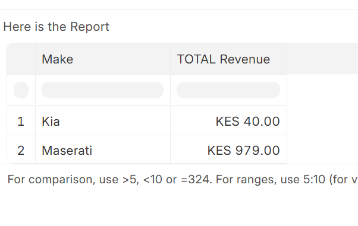
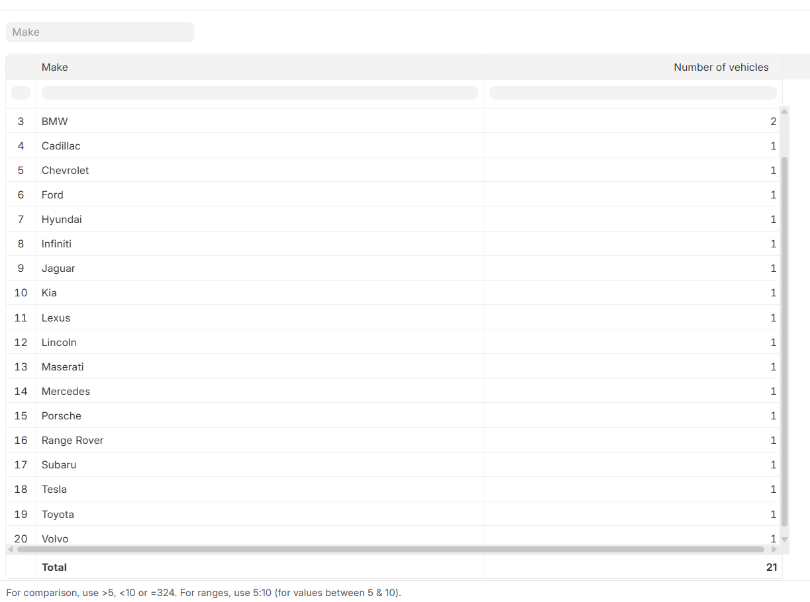

# Rentals

A rental management application built with Frappe Framework  it is primarily used in a site called irfan.cabs and is used to manage the booking and renting out of cars

## Features

- Store Driver Details
- Store Ride Order Details
- Book a Ride
- Calculate the cost of a particular ride based on the rate and the distance

## Installation

Clone the repository inside your Frappe bench apps directory:

```bash
cd frappe-bench/apps
git clone  https://github.com/Nalish/rentals.git
```


```bash
cd ..
bench install-app rentals
```

Run the server:

```bash
bench start
```

Open in your browser:

http://localhost:8000


## Screenshots

### Order a ride




### Reports

#### Revenue By Make


#### Vehicles By Make


